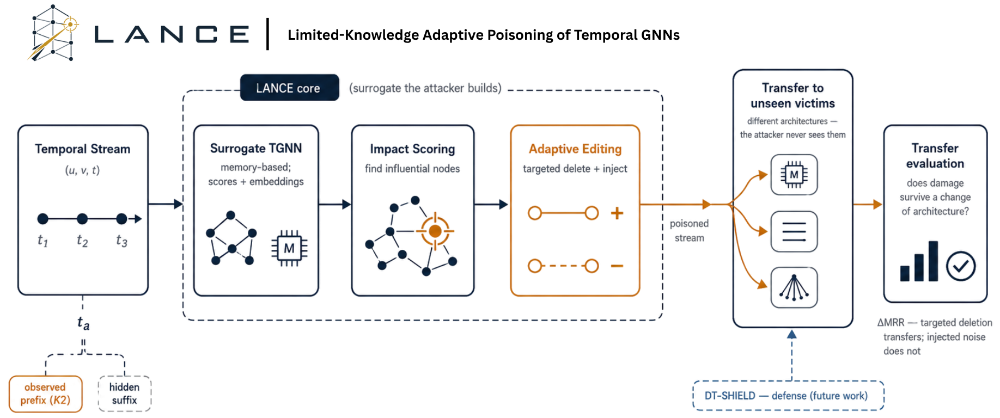

<p align="center">
  
</p>

# LANCE

**Limited-knowledge adaptive poisoning of temporal graph neural networks.**

LANCE is a research framework for studying training-time poisoning attacks against
temporal GNN link predictors under *realistic* adversary knowledge. It re-implements
the three components of the High Impact Attack (HIA) — a surrogate model,
impact-aware target selection, and hybrid edit (injection + deletion) budgeting —
inside a leakage-safe, reproducible evaluation harness, and adds a first-order
*damage-aware* edit scorer that ranks candidate edits by their estimated marginal
effect on the victim's ranking loss.

The emphasis of this project is measurement. Poisoning results on temporal graphs
are easy to overstate: random negative sampling can hide deletion effects, unpaired
runs confuse training variance with attack strength, and full-history surrogates
quietly leak the future. LANCE is built so that such confounds are controlled by
construction, and so that every reported number is regenerable from the repository.

## Status and scope

LANCE is a **research prototype** evaluated in two regimes. In the *white-box*
setting, where the victim shares the surrogate's architecture, targeted poisoning
does **not** reliably beat random baselines — an *unlearning gap* (the retrained
victim absorbs targeted injections while un-fittable random noise persists) explains
why. In the more realistic *transfer* setting, where the attacker does not know the
victim's architecture, LANCE is the **most reliably transferable attack across five
datasets and two victim families**: its targeted deletions of high-impact edges
damage unseen models where injected noise does not. The contribution is a rigorous,
leakage-safe evaluation harness plus this transfer finding — and the argument that
transferability, not white-box strength, is how such attacks should be measured.

## Highlights

- **Limited-knowledge regimes.** K1 (full-history upper bound), strict K2
  (observable-prefix only; the hidden suffix cannot influence any edit), and an
  experimental K3 streaming variant.
- **Hardened evaluation.** Paired per-seed initialization, fixed clean
  destination/history pools, tie-aware MRR / Hit@*k*, TGB-style historical
  negatives, and paired *t*- and Wilcoxon tests.
- **Structurally valid perturbations.** Injected events respect source-side
  domain and timestamp/feature distributions; self-loops, duplicates, and exact
  existing events are rejected.
- **Damage-aware scorer.** A first-order influence scorer (`lance_meta`) that
  ranks edits by alignment with the gradient of the victim's ranking loss.
- **Fair controls and ablations.** `random`, `random_delete`, `random_inject`,
  HIA, and component/targeting ablations of LANCE, so no result rests on a weak
  baseline.
- **Pure PyTorch.** No DGL; runs on CPU or a single GPU.

## How it works

<p align="center">
  
</p>

The attack trains a memory-based surrogate on the observable prefix (K2), scores
node impact, and spends a small budget on **targeted deletions and injections**. The
poisoned stream is then evaluated on **victim architectures the attacker never
sees** — and the main result is that this targeted, deletion-driven poisoning
**transfers** to those unseen models, where injected noise does not. DT-SHIELD (a
deletion-aware defense) is a future extension.

## Repository layout

```text
lance/
├── attack/     # HIA, LANCE adaptive-hybrid core, meta-gradient scorer, baselines
├── models/     # TGNLite: memory-based TGN + link predictor + time encoding
├── training/   # TBPTT trainer (predict-then-update; no self-leakage)
├── eval/       # tie-aware MRR/Hit@k, historical-negative ranking
├── defense/    # DT-SHIELD components (defensive extension)
└── data/       # temporal-graph loaders, negative sampling
configs/         # per-dataset YAML
scripts/         # train / attack / benchmark entry points
tests/           # unit and invariant tests
```

## Installation

Requires Python 3.11 and PyTorch (CUDA optional).

```bash
pip install -r requirements.txt
# optional, for exact-parity Leiden communities in the impact score:
pip install python-igraph leidenalg
```

## Data

LANCE uses public continuous-time benchmarks (JODIE/SNAP): MOOC, Wikipedia,
LastFM, and Bitcoin-OTC. Datasets are **not** bundled. Download the CSVs and place
them where each config's `data.root` points — by default `../Dataset` (a sibling
of the repository), e.g. `../Dataset/mooc.csv` — or edit `data.root` in
`configs/*.yaml`.

## Quickstart

```bash
# Train and evaluate a clean victim
python scripts/train.py --config configs/mooc.yaml

# Run the full LANCE attack under limited knowledge (K2) and report the
# clean-vs-attacked gap (the surrogate is built from the observable prefix only)
python scripts/run_lance.py --config configs/mooc.yaml --knowledge k2 --ptb-rate 0.3

# Run a paired attack benchmark (defense × attack × seed grid)
python scripts/benchmark.py --config configs/mooc.yaml \
    --defenses none \
    --attacks none random random_delete random_inject hia lance \
    --seeds 0 1 --epochs 12 --ptb-rate 0.3 --hist-neg 0.7
```

Each benchmark writes a Markdown summary and a JSON record — per-seed metrics,
edit counts, statistical tests, and attack diagnostics — under `artifacts/`
(regenerable, and excluded from version control).

### Reproducing the corrected effectiveness gate

```bash
python scripts/benchmark.py --config configs/mooc.yaml \
    --defenses none \
    --attacks none random random_delete random_inject hia lance \
    --seeds 0 1 2 3 4 --epochs 12 --max-events 40000 \
    --ptb-rate 0.3 --hist-neg 0.7
```

## Testing

```bash
pytest -q
```

The suite covers data loading, model contracts, ranking metrics, candidate
validity, strict-K2 isolation, component ablations, and diagnostic serialization.

## Citation

```bibtex
@misc{hakim2026lance,
  author = {Safayat Bin Hakim},
  title  = {LANCE: A Limited-Knowledge Adaptive Poisoning Study for
            Temporal Graph Neural Networks},
  year   = {2026},
  note   = {Research prototype},
  url    = {https://github.com/sbhakim/lance-attack}
}
```

## License

Released under the MIT License; see [`LICENSE`](LICENSE).

## Acknowledgments

Supported by the NSF Industry–University Cooperative Research Center (I/UCRC) CARTA.
