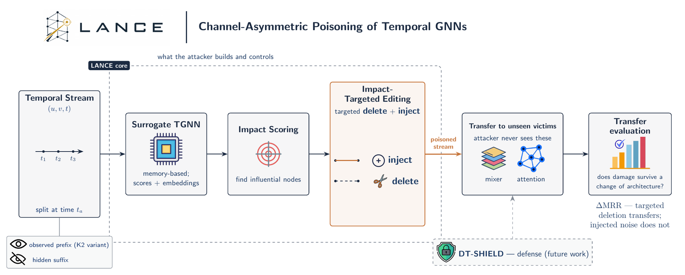

<p align="center">
  
</p>

# LANCE

**Limited-knowledge adaptive poisoning of temporal graph neural networks.**

LANCE is a research framework for studying training-time poisoning attacks against
temporal GNN link predictors under *realistic* adversary knowledge. It re-implements
the three components of the High Impact Attack (HIA) — a surrogate model,
impact-aware target selection, and hybrid edit (injection + deletion) budgeting —
inside a leakage-safe, reproducible evaluation harness, and adds a first-order
*damage-aware* edit scorer that ranks candidate edits by their estimated marginal
effect on the victim's ranking loss.

The emphasis of this project is measurement. Poisoning results on temporal graphs
are easy to overstate: random negative sampling can hide deletion effects, unpaired
runs confuse training variance with attack strength, and full-history surrogates
quietly leak the future. LANCE is built so that such confounds are controlled by
construction, and so that every reported number is regenerable from the repository.

## Status and scope

LANCE is a **research prototype**, and its main result is that the two editing
channels are asymmetric in a way that tracks the *victim's architecture* rather than
what the attacker knows. Against a memory-based victim, injected noise is the
strongest attack and deleting real interactions does nothing. Against memory-free
victims, across five datasets and two victim families, the ordering reverses:
targeted deletion is the **strongest transferable attack** — roughly twice the best
undirected control — while injection transfers inconsistently and often *improves*
the victim.

Two qualifications matter. The claim we defend is **magnitude, not breadth**:
undifferentiated `random_delete` is positive in as many victim×dataset cells, so
targeting buys size of effect rather than consistency of it. And the advantage is
**budgeted**, resolvable from a 10–20% perturbation rate and absent at 5%. The
contribution is this channel finding plus a reproducible, leakage-safe harness — and
the argument that a single victim architecture measures one channel and hides the
other.

## Highlights

- **Reproducible by construction.** Deterministic kernels, recorded provenance
  (git SHA, victim, surrogate, library versions) in every artifact, and a summarizer
  that refuses to average across protocols. Seeding alone left repeats drifting by
  more than the effects being compared.
- **Knowledge regimes.** K1 (full history; the setting all reported gates use) and
  K2 (observable-prefix only, with prefix-relative or K1-matched budget).
- **Hardened evaluation.** Paired per-seed initialization, fixed clean
  destination/history pools, tie-aware MRR / Hit@*k*, TGB-style historical
  negatives, and paired *t*- and Wilcoxon tests.
- **Structurally valid perturbations.** Injected events respect source-side
  domain and timestamp/feature distributions; self-loops, duplicates, and exact
  existing events are rejected.
- **Damage-aware scorer.** A first-order influence scorer (`lance_meta`) that
  ranks edits by alignment with the gradient of the victim's ranking loss.
- **Fair controls and ablations.** `random`, `random_delete`, `random_inject`, HIA,
  an EdgeBank memorization reference, and component/targeting ablations — with a test
  asserting every attack spends its full budget, after two were found under-spending.
- **Pure PyTorch.** No DGL; runs on CPU or a single GPU.

## How it works

<p align="center">
  
</p>

The attack trains a memory-based surrogate, scores node impact, and spends its budget
on **impact-targeted deletions and injections**. The poisoned stream is then evaluated
on **victim architectures the attacker never sees**. The main result is that the
*deletion* channel transfers to those unseen models while injected noise does not —
and that which channel threatens a model tracks its architecture rather than what the
attacker knows. K2 (observable-prefix only) is an implemented variant; the reported
gates use K1. DT-SHIELD, a deletion-aware defense, is a future extension.

## Repository layout

```text
lance/
├── attack/     # HIA, LANCE adaptive-hybrid core, meta-gradient scorer, baselines
├── models/     # TGNLite: memory-based TGN + link predictor + time encoding
├── training/   # TBPTT trainer (predict-then-update; no self-leakage)
├── eval/       # tie-aware MRR/Hit@k, historical-negative ranking
├── defense/    # DT-SHIELD components (defensive extension)
└── data/       # temporal-graph loaders, negative sampling
configs/         # per-dataset YAML
scripts/         # train / attack / benchmark entry points
tests/           # unit and invariant tests
```

## Installation

Requires Python 3.11 and PyTorch (CUDA optional).

```bash
pip install -r requirements.txt
# optional, for exact-parity Leiden communities in the impact score:
pip install python-igraph leidenalg
```

## Data

LANCE uses public continuous-time benchmarks (JODIE/SNAP): MOOC, Wikipedia,
LastFM, and Bitcoin-OTC. Datasets are **not** bundled. Download the CSVs and place
them where each config's `data.root` points — by default `../Dataset` (a sibling
of the repository), e.g. `../Dataset/mooc.csv` — or edit `data.root` in
`configs/*.yaml`.

## Quickstart

```bash
# Train and evaluate a clean victim
python scripts/train.py --config configs/mooc.yaml

# Run the full LANCE attack under limited knowledge (K2) and report the
# clean-vs-attacked gap (the surrogate is built from the observable prefix only)
python scripts/run_lance.py --config configs/mooc.yaml --knowledge k2 --ptb-rate 0.3

# Run a paired attack benchmark (defense × attack × seed grid)
python scripts/benchmark.py --config configs/mooc.yaml \
    --defenses none \
    --attacks none random random_delete random_inject hia lance \
    --seeds 0 1 --epochs 12 --ptb-rate 0.3 --hist-neg 0.7
```

Each benchmark writes a Markdown summary and a JSON record — per-seed metrics,
edit counts, statistical tests, and attack diagnostics — under `artifacts/`
(regenerable, and excluded from version control).

### Reproducing the corrected effectiveness gate

```bash
python scripts/benchmark.py --config configs/mooc.yaml \
    --defenses none \
    --attacks none random random_delete random_inject hia lance \
    --seeds 0 1 2 3 4 --epochs 12 --max-events 40000 \
    --ptb-rate 0.3 --hist-neg 0.7
```

## Testing

```bash
pytest -q
```

The suite covers data loading, model contracts, ranking metrics, candidate
validity, strict-K2 isolation, component ablations, and diagnostic serialization.

## Citation

```bibtex
@misc{hakim2026lance,
  author = {Safayat Bin Hakim and Wenkai Tan and Stefani Mancas and
            Sirani Mututhanthrige Perera and Houbing Herbert Song},
  title  = {Targeted Deletion Transfers, Injected Noise Does Not:
            Channel-Asymmetric Poisoning of Temporal Graph Neural Networks},
  year   = {2026},
  note   = {Research prototype; code for the LANCE attack and evaluation harness},
  url    = {https://github.com/sbhakim/lance-attack}
}
```

## License

Released under the MIT License; see [`LICENSE`](LICENSE).

## Contact

Please open an issue for project questions or contact Safayat Bin Hakim at
safayat DOT b DOT hakim AT gmail DOT com.

## Acknowledgments

Supported by the NSF Industry–University Cooperative Research Center (I/UCRC) CARTA.
